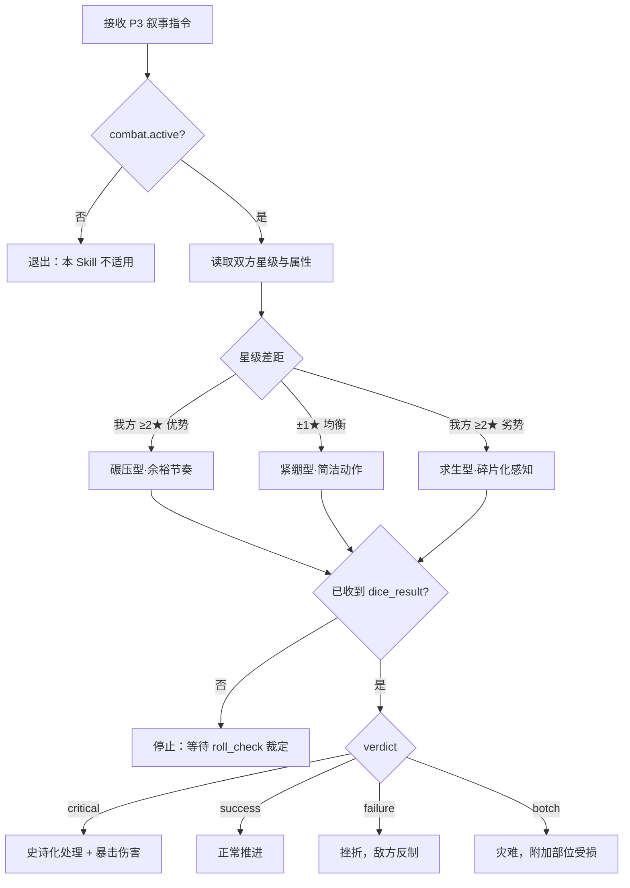

# 战斗叙事专项规则

## 决策图（Decision Gate）

## 铁律 [HARD-GATE]

每段战斗叙事生成后逐条核查，违反任一条必须停止并重写：

- [ ] **骰子先行**：描述伤害/成败前，`roll_check` / `roll_dice` 的 `verdict` 必须已注入；禁止在叙事中预判或篡改 `verdict`。
- [ ] **能力边界**：角色使用的技能/武器必须在其已解锁清单内（`read_character` → loadout）；未兑换能力一律不得出现。
- [ ] **敌人主体性**：敌方依自身战术行动，不因剧情需要而无故失误、无故手软。
- [ ] **星级压制**：战力差 ≥2★ 时，弱方不得正面击败强方（除非动用已登记的系统兑换底牌）。
- [ ] **心理比例**：内心独白 ≤ 正文 15%（意识流文风章节除外）。

## 执行流程

1. **确认战力差距**：`read_character` 取我方属性与星级，对照敌方档案，标注星级差。
2. **选择战斗节奏**：从「快速收割 / 胶着拉锯 / 战略撤退 / 消耗为主 / 奇谋逆转」中择一，与决策图分支一致。
3. **引用骰子裁定**：每个关键动作对应一次 `roll_check`（属性 d10 骰池，`verdict ∈ {critical, success, failure, botch}`）；命中后用 `roll_hit_location` 决定部位。
4. **结算数值**：伤害以变量命令输出，由 Calibrator 在 P4 结算：
   - 普通伤害 `{{ADD: meta.hp=-N}}`
   - 绝杀 / verdict=critical `{{SET: meta.hp=0}}`
   - 自身受创 `{{ADD: meta.hp=-N}}` + `{{PUSH: meta.injuries=部位}}`
5. **战后奖励**：击败敌人后调用 `apply_damage` 收尾，并由 DM 侧 `earn_sp_by_kill`（crossover）或 `earn_battle_rewards`（infinite_arsenal）发放积分。

## 集成说明

- **骰子系统**：`backend/engine/dice.py` 的 `verdict` 字段为唯一胜负来源；叙事只解释结果，不生产结果。
- **战斗状态**：`get_combat_status` 读当前 HP/部位；`apply_damage` / `apply_heal` 写入，禁止叙事内裸改数值。
- **经济系统**：击杀结算走 `earn_sp_by_kill`（按星级 L/M/U 系数）或 `earn_battle_rewards`。
- **记忆系统**：战斗关键转折由 Calibrator 自动写入 episodic 记忆层，供后续召回。

## 禁词与风格约束

在全局禁词基础上，本 Skill 激活期间额外禁用：

- 浴血奋战、势如破竹、一招制敌、所向披靡（套路化套话）
- 「强如……」「仿佛」「似乎」（万能动词 / 模糊词）
- 三连排比与三段式情绪递进（数字 3 限制）

**推荐替代**：用具体动作锚定威力——不写「剑法精妙」，写「剑尖走了道弧线，从肘内侧切进去」。
