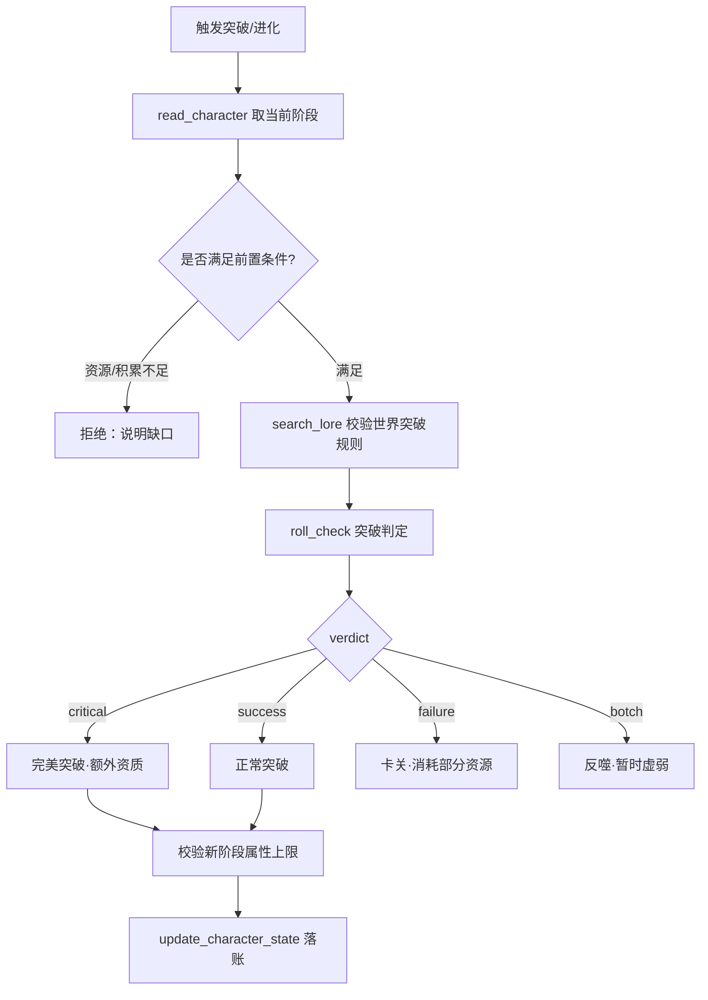

# 境界突破 / 进化专项规则

## 决策图（Decision Gate）

## 铁律 [HARD-GATE]

- [ ] **条件前置**：突破必须有具体依据（资源/积累/契机），不得「水到渠成」式无成本跃迁。
- [ ] **上限封顶**：突破后属性不得超过新阶段上限（如 ESP/PSY、内力、进化阶段 cap）；越界改为触发进化事件而非直接赋值。
- [ ] **骰子裁定**：突破成败由 `roll_check` 的 `verdict` 决定，禁止叙事内预设成功。
- [ ] **能力分级**：自然突破只覆盖 A/C 级能力；需要 B/D 级（专家知识/独立创造）必须经系统兑换，不能靠「努力/聪明」自得。
- [ ] **代价对应**：failure/botch 必须落实资源消耗或暂时虚弱，不可无损重试。

## 执行流程

1. **读状态**：`read_character` 取当前境界/进化阶段、关键属性与资源池。
2. **校验前置**：核对突破所需资源与积累；不足直接 BLOCK 并说明缺口。
3. **查规则**：`search_lore` 确认该世界的突破/进化机制与阶段上限（无结果再联网，结论须固化 add_lore）。
4. **掷骰**：`roll_check`（对应属性 d10 骰池），读取 `verdict`。
5. **结算**：按 verdict 写变量命令，由 Calibrator 落账：
   - 成功 `{{ADD: meta.stage=+1}}` + `{{ADD: char.<ATTR>=+N}}`（受新上限钳制）
   - 卡关 `{{ADD: meta.resource=-N}}`
   - 反噬 `{{ADD: char.<ATTR>=-N}}` + `{{PUSH: meta.status=虚弱}}`
6. **回写**：`update_character_state` 持久化新阶段。

## 集成说明

- **世界插件**：阶段上限来自各 WorldPlugin 的 `attribute_schema` / `validate_attribute_update`；crossover 进化由 Hook `before_var_update` 拦截超限赋值。
- **骰子系统**：突破判定难度（DC）随阶段提升递增，由 RulesAgent 设定。
- **兑换系统**：跨越到 B/D 级能力须走三轮定级兑换（见 item-appraisal / gacha-resolution）。
- **记忆系统**：突破为重大事件，自动写入 episodic 并更新角色成长弧线。

## 禁词与风格约束

- 禁「突飞猛进」「一日千里」「脱胎换骨」等进度套话。
- 禁三段式「积蓄→爆发→升华」排比叙事，选其一深写。
- 突破体验用具体身体/感官变化锚定，不空喊「力量充盈全身」。
