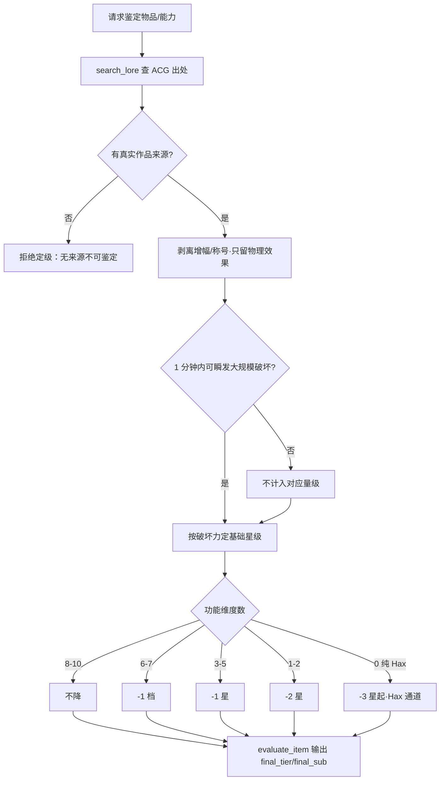

# 物品鉴定与 Anti-Feat 定级规则

## 决策图（Decision Gate）

## 铁律 [HARD-GATE]

- [ ] **真实出处优先**：鉴定结论必须能指向某部现实 ACG 作品；先 `search_lore` 查库，无果再联网，禁止编造来源。
- [ ] **物理剥离**：只看真实物理破坏效果，设定逼格/称号/不可思议描述一律作废。
- [ ] **时间门控**：大规模破坏须能在 1 分钟内瞬发才计入对应量级。
- [ ] **维度降级**：按功能丰富度套用降级算法（见决策图），不得直接采信原作宣称的强度。
- [ ] **payload 完整**：定级结果必须含 `final_tier` + `final_sub`(L/M/U) + 具体 `payload`，禁止空对象占位。

## 执行流程

1. **查来源**：`search_lore` 检索物品/能力的 ACG 出处与原作表现；无结果联网核实后 `add_lore` 固化。
2. **物理剥离**：剔除能量增幅与维持型 buff，保留天生物理特性（第一轮）。
3. **维度计数**：统计该能力覆盖的功能维度数，套用降级算法得调整后星级（第二轮）。
4. **横向校准**：对照已收录同级物品挤水，确认最终 `final_tier`/`final_sub`（第三轮）。
5. **输出**：`evaluate_item` / `evaluate_weapon` 返回标准化定级，附 `payload`（effects/abilities）。

## 集成说明

- **物品系统**：`final_tier`/`final_sub` 对接 `item_catalog` / `owned_items`；与 `shop-evaluation` 共用定级口径。
- **武库世界**：infinite_arsenal 用 `evaluate_weapon`，输出 weapon_tier（Ω/S/A/B/C）。
- **能力分级**：鉴定结果同时标注 A/B/C/D 能力类型，供 breakthrough / 兑换判定参考。
- **知识库**：新来源经 `add_lore` 写入 RAG，标注来源与抓取时间，未核实者标 [内置知识·未经网络核实]。

## 禁词与风格约束

- 禁「逆天神器」「不可估量」「深不可测」等夸张鉴定腔。
- 禁用原作宣传语直接当结论（如「一刀斩星」需剥离为可瞬发的真实当量）。
- 定级陈述用客观维度与数字，避免情绪化堆叠。
