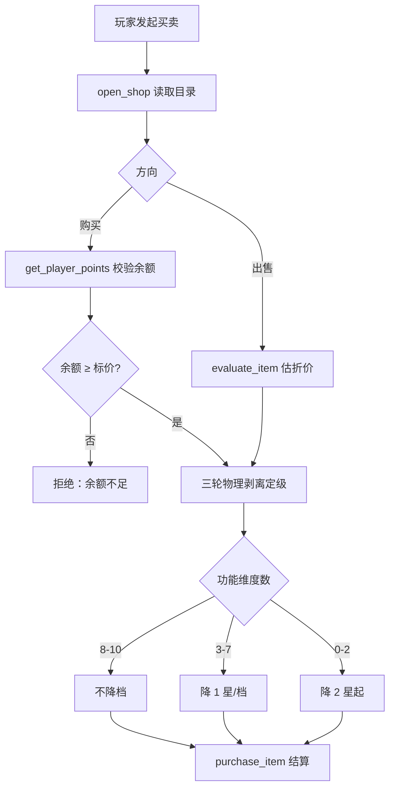

# 商店购买与出售评估规则

## 决策图（Decision Gate）

## 铁律 [HARD-GATE]

- [ ] **真实出处**：任何售出的能力/装备必须打上某部现实 ACG 作品来源标签，禁止凭空生造无来源道具。
- [ ] **流派不拆分**：武术/忍术/魔法体系类必须以「完整流派大全套」发放，不可拆单招售卖。
- [ ] **余额硬校验**：购买前 `get_player_points` 必须确认余额 ≥ 标价；不得透支或负数结算。
- [ ] **物理剥离**：定价只看 1 分钟内可瞬发的真实物理破坏效果，逼格/称号/设定光环一律作废。
- [ ] **结算落账**：成交后必须用变量命令扣减货币，禁止只叙事不落账。

## 执行流程

1. **拉取目录**：`open_shop` 取当前可售清单（crossover 走汪吧经济，infinite_arsenal 走武库卡池外的直购）。
2. **三轮定级**（来自 02 兑换评估协议）：
   - 第一轮：剥离能量增幅与维持型 buff，只留天生物理特性。
   - 第二轮：按功能维度数套用降级算法（见决策图）。
   - 第三轮：横向对照已收录同级 ACG 物品，挤掉水分确认星级。
3. **定价 / 估值**：购买取标价；出售用 `evaluate_item` 折价（一般 30%–60%，孤品上浮）。
4. **结算**：
   - 购买 `{{ADD: meta.SP=-N}}` + `{{PUSH: meta.inventory=物品键}}`
   - 出售 `{{ADD: meta.SP=+N}}` + `{{PULL: meta.inventory=物品键}}`
5. **调用** `purchase_item` 落库并触发库存 Part。

## 集成说明

- **经济系统**：主货币 SP；汪吧点/战功按 `EconomyConfig.exchange_rates` 折算，声望不可换算。
- **物品系统**：`evaluate_item` 复用 Anti-Feat 星级；与 `item-appraisal` Skill 共享定级口径。
- **权限**：`purchase_item` 默认 `ask`，结算前向玩家确认。
- **记忆系统**：大额交易（>10 万等价）写入 episodic 记忆，便于后续追溯经济线。

## 禁词与风格约束

- 禁「物超所值」「血赚」「无脑买」等导购腔。
- 禁用三连排比罗列卖点（卖点 ≤2 项）。
- 价格与星级用客观数字陈述，不堆砌情绪形容词。
