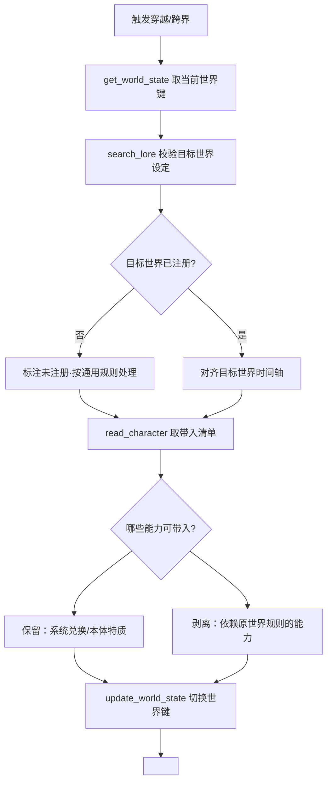

# 穿越 / 跨界专项规则

## 决策图（Decision Gate）

## 铁律 [HARD-GATE]

- [ ] **时间轴对齐**：进入目标世界须锚定其当前时间点；该时间点尚未发生的原作技术/事件/概念一律不存在。
- [ ] **预知边界**：主角的原作预知只覆盖剧情走向与人物动机（A 级），不含技术细节与精确日期。
- [ ] **能力迁移规则**：系统兑换能力与本体特质随身带入；依赖原世界底层规则的能力（特定灵气/网络/规则系）在新世界须重新校验或失效。
- [ ] **身份敏感**：迁移后的身份/国籍/阵营须符合目标世界的政治生态，不得无视当地敌我关系。
- [ ] **状态迁移落账**：世界键切换必须经 `update_world_state` 与 `<system_grant type="world_traverse">`，禁止只叙事不切档。

## 执行流程

1. **读现状**：`get_world_state` 取当前 `world_plugin` 键与世界状态快照。
2. **校验目标**：`search_lore(world_key=目标键)` 核对目标世界设定与时间轴；无结果再联网并 `add_lore` 固化。
3. **裁定带入**：`read_character` 取能力清单，按铁律区分「保留 / 剥离 / 待校验」。
4. **切换世界**：`update_world_state` 写入新 `world_plugin` 键，触发对应 WorldPlugin 的 `on_session_init`（重置该世界专属属性，如 ESP/内力起点）。
5. **发放迁移**：输出 `<system_grant type="world_traverse">`，由 Calibrator 解析并迁移角色档案。

## 集成说明

- **世界插件**：目标世界键须存在于 `world_keys_registry.json`；切换后属性体系/经济/物品类型随新 WorldPlugin 生效。
- **能力分级**：带入能力的星级在新世界重走物理剥离口径（与 item-appraisal 一致）。
- **记忆系统**：跨界为里程碑事件，semantic 层记录世界切换；旧世界 NPC 关系冻结而非删除。
- **链路 B**：Calibrator 解析 `world_traverse` grant 完成档案迁移，Cursor/工具侧无需手动迁移。

## 禁词与风格约束

- 禁「熟悉又陌生的世界」「命运的齿轮开始转动」等穿越套话。
- 禁主角落地即全知全能的上帝视角口吻。
- 新世界首印象用具体差异（气味/语言/光照/科技代差）锚定，不空写「一切都不一样了」。
