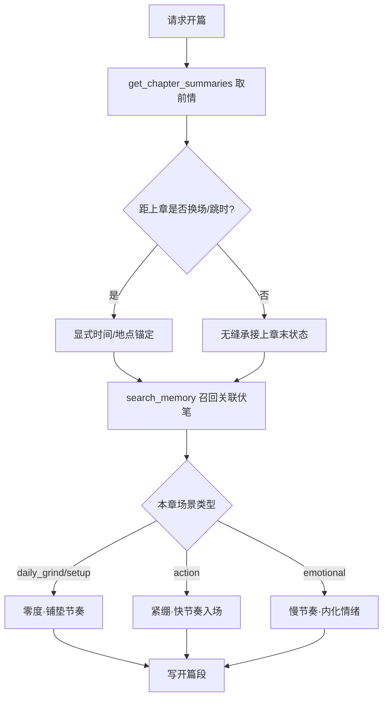

# 章节开篇专项规则

## 决策图（Decision Gate）

## 铁律 [HARD-GATE]

- [ ] **承接连续**：开篇状态必须与上一章末尾（HP/位置/在场 NPC/未决伏笔）一致，不得凭空重置。
- [ ] **时间数学**：涉及「X天/X月前」时，必须对照章节时间轴用真实天数，禁止拍脑袋。
- [ ] **视角盲区**：开篇只能写主角此刻可感知的信息；主角不知道的事不得进入其视角叙事。
- [ ] **不剧透**：不预告本章后续走向，不写「他没想到接下来……」式上帝旁白。
- [ ] **术语锚定**：军用时间/型号/代号等首次出现必须在正文内给读者锚点。

## 执行流程

1. **取前情**：`get_chapter_summaries` 读最近章节摘要；必要时 `read_chapter` 回看上一章结尾。
2. **召回伏笔**：`search_memory` 检索与本章相关的未决 hook 与关键 NPC 状态。
3. **判定切换**：判断是否换场/跳时，决定是否需要显式时间地点锚（见铁律）。
4. **选定节奏**：按场景类型激活对应文风（零度 / 紧绷 / 慢节奏），与决策图一致。
5. **生成开篇**：以具体感官细节 + 一个清晰的当前目标收束首段，给读者方向感。

## 集成说明

- **记忆系统**：`get_chapter_summaries` 来自 semantic 层章节摘要；`search_memory` 走向量+BM25 混合召回。
- **章节系统**：可配合 `outline_chapter` 在 P1 已生成的细纲；开篇须落在细纲约定的起点。
- **文风层**：开篇文风由会话配置的 Layer 5 文风 Skill 叠加，本 Skill 只约束结构与锚点。

## 禁词与风格约束

- 禁「阳光透过窗户」「平静的一天被打破」等开篇套话。
- 禁以天气/景物大段铺陈拖延入场（景物 ≤2 句即转入动作或目标）。
- 禁三段式渐强情绪开场，选最强的一个切入点。
