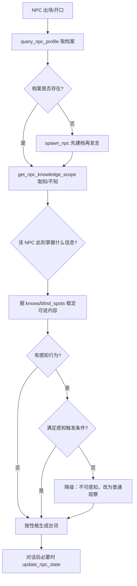

# NPC 深度对话专项规则

## 决策图（Decision Gate）

## 铁律 [HARD-GATE]

- [ ] **信息依据**：NPC 的每个判断/态度都要能回答「他此刻掌握了什么具体信息支撑此行为」；无依据则不成立。
- [ ] **不知不说**：NPC 不得知晓主角未透露的信息（对照 `knowledge_scope.blind_spots`）。
- [ ] **能力封顶**：NPC 的感知/技能不得超出其 `capability_cap`；静默收敛的对手不能被无特殊感知者「感应」到。
- [ ] **性格守恒**：台词措辞符合其教育/文化背景与 `core_values`；核心价值观无铺垫不得颠覆。
- [ ] **标签后置**：说话者标注在对话后或内部，禁止「他说道：」前置式。

## 执行流程

1. **取档案**：`query_npc_profile` 读 `psyche_model_json`（core_values / knowledge_scope / capability_cap / behavior_patterns）。
2. **缺档处理**：无档案先 `spawn_npc` 建档，不得凭感觉直接开口。
3. **框定信息**：`get_npc_knowledge_scope` 确认 knows / blind_spots，据此裁剪 NPC 可表达内容。
4. **感知校验**：若 NPC 做出「察觉气势/杀意」类行为，先核对感知触发条件（主动释放 / 能力外泄 / 有专项感知）；不满足则降级为普通微表情观察。
5. **生成与回写**：按性格与情绪状态产出台词；若本轮 NPC 认知/信任发生变化，`update_npc_state` / `edit_npc_state` 回写。

## 集成说明

- **角色系统**：NPC 档案存于 `psyche_model_json`；主角状态用 `query_character_summary` 交叉确认信息不对称。
- **信息矩阵**：knows/blind_spots 对应信息不对称矩阵；对话不得越过矩阵约束。
- **NPC 子会话**：深度对话可由 `npc_agent` 接管，本 Skill 的边界规则对子会话同样生效。
- **记忆系统**：关系/信任变化由 Calibrator 写入，跨章对话须保持连续。

## 禁词与风格约束

- 禁「语气温柔地」「眼中闪过一丝……」等贴标签式心理直述。
- 禁「瞳孔地震」「破防」等网络梗。
- 长对话（>3 行）后必须插入一处动作或环境描写，避免对话悬空。
