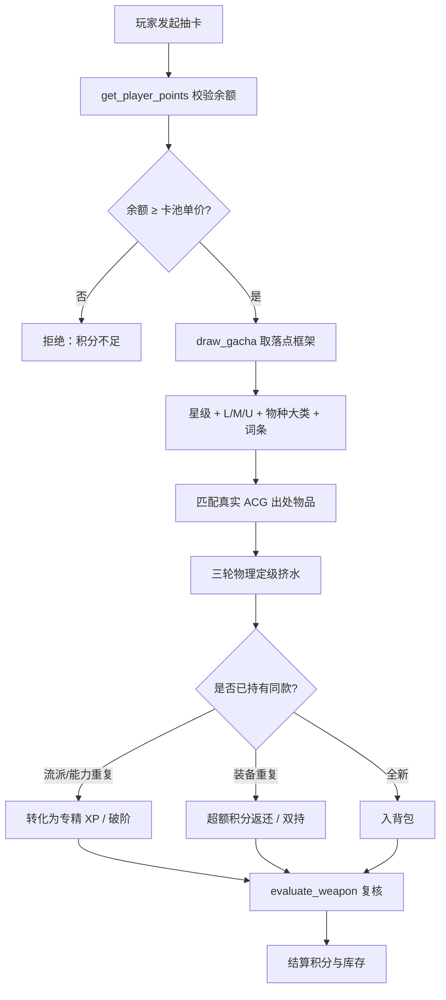

# 抽卡结算专项规则

## 决策图（Decision Gate）

## 铁律 [HARD-GATE]

- [ ] **余额先扣**：`draw_gacha` 前 `get_player_points` 校验，扣费成功才生成落点，禁止透支。
- [ ] **落点不可篡改**：星级 / L-M-U 子段 / 物种大类由 `draw_gacha` 返回，叙事与发货不得擅自抬级。
- [ ] **真实出处**：每件发货物品必须打现实 ACG 作品来源标签，禁止生造无来源道具。
- [ ] **流派完整**：抽中体系类（武术/忍术/魔法）必须发「完整流派大全套」，从入门起步，不拆单招。
- [ ] **三轮定级**：发货前过物理剥离 + 维度降级 + 横向校准，确认无水分再交付。

## 执行流程

1. **校验余额**：`get_player_points` 确认 ≥ 卡池单价（综合池/战术池/战略池价格不同）。
2. **抽取落点**：`draw_gacha(pool_name, count)`，获取 `[星级][L/M/U][物种大类][定向词条]` 框架。
3. **匹配发货**：据落点框架匹配/发散真实 ACG 出处物品，确定具体名称与 payload。
4. **三轮定级**：复用 item-appraisal 口径过一遍物理剥离与降级，`evaluate_weapon` 复核最终星级。
5. **重复处理**：
   - 同流派/能力重复 → `{{ADD: meta.<skill>_xp=+N}}`（封顶则破阶/融合）
   - 同装备重复 → `{{ADD: meta.SP=+N}}`（超额返还）或双持叠加
   - 全新 → `{{PUSH: meta.inventory=物品键}}`
6. **落账**：扣费 `{{ADD: meta.SP=-N}}`，触发抽卡 Part 展示落点动画。

## 集成说明

- **经济系统**：卡池单价与返还走 SP 主货币；徽章可多块消耗叠加 `[附加词条]` 开定向池。
- **物品系统**：发货物品入 `owned_items`，infinite_arsenal 标 weapon_tier，crossover 标 Anti-Feat 星级。
- **评估协议**：与 `item-appraisal` 共享三轮物理定级；`evaluate_weapon` 为复核入口。
- **知识库**：新收录 ACG 来源经 `add_lore` 写入 `acg-source-registry`，避免重复发散冲突。

## 禁词与风格约束

- 禁「欧皇附体」「一发入魂」「血赚不亏」等抽卡梗。
- 禁三连排比罗列奖励，落点陈述 ≤2 项要点。
- 出货叙事重「选择」与来源感，不堆砌「金光闪耀」式廉价特效词。
