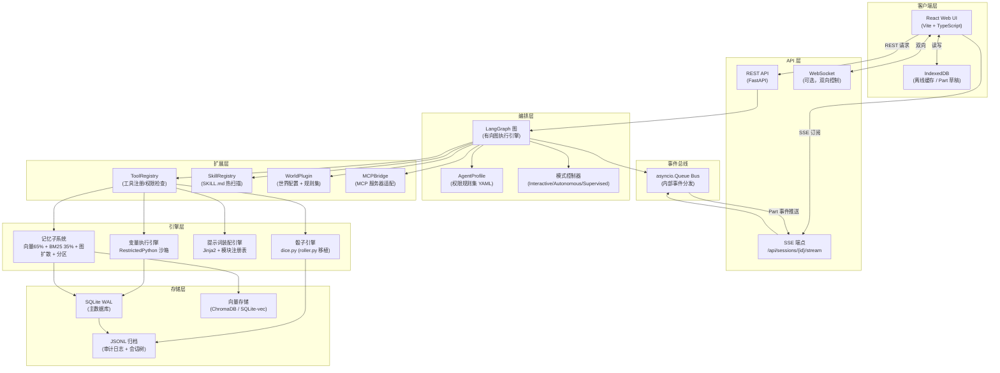
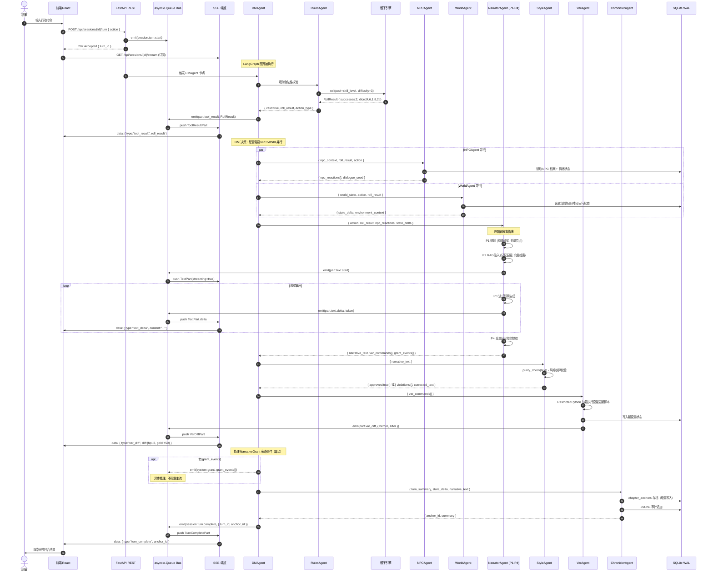
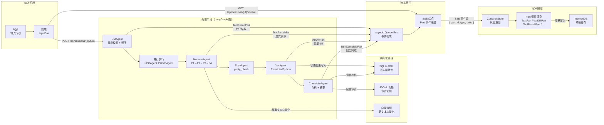

# 02 · 系统架构设计文档

> **文档版本**：v1.1（2026-06 对齐实现） · 2026-05-31  
> **适用项目**：zero-arsenal  
> **状态**：架构基线（能力实装 ~80%，文档契约已按实现修订）  
> **关联文档**：`01-project-analysis.md`（来源分析）
>
> 注：本文档已于 2026-06 对齐实现（D0 以代码为准）。七层架构、回合管线、八类扩展能力、四阶段叙事、并行/串行约束均真实实装；下列「目录/命名/端点/技术选型」契约按实现修正（设计 v1.0 已滞后于实现演进）。
>
> **实现对齐总览（2026-06）**
> - **扩展点位置**：实际采用「**每插件一目录 + manifest.json**」统一插件架构（`backend/extensions/<world>/{plugin,tools,hooks,manifest}`），**非**按类型分 `worlds/tools/skills/mcp` 子目录。ToolRegistry 在 `backend/tools/registry.py`、SkillRegistry 在 `backend/tools/skill_loader.py`、MCPBridge 在 `backend/tools/mcp_bridge.py`（均不在 `extensions/` 下）。
> - **Hook 层**：独立于 `backend/hooks/`（`hook_manager.py`/`builtin_hooks.py`）+ `backend/extensions/hook_protocol.py`，而非归入 `bus/`；§2 分层图与 §4 目录树应补 `hooks/` 层。
> - **入口端点**：提交回合为 `POST /api/sessions/{id}/message`（202 Accepted，非 `/turn`）；订阅为 `GET /api/sessions/{id}/events`（非 `/stream`）。
> - **回合拓扑**：实际连边 `rules → dm_gate → (dice) → parallel_nw → narrator → style → var → chronicler → options → END`——rules 节点先于 dm_gate、dice 为独立节点、`npc‖world` 合并进单节点 `parallel_nw`（asyncio.gather）、新增 `options` 节点；MODE 节点旧命名 Interactive/Autonomous/Supervised 应改为 play/plan/review。
> - **文件命名**：变量执行引擎为 `backend/engine/vm.py`（非 `var_executor.py`）；DB 用裸 aiosqlite + `schema.py`/`queries.py`（**无 SQLAlchemy `models.py`、无 `migrations/` 目录**，改手写 `MIGRATION_PATCHES_SQL`）；agents/profiles 按**模式**组织（play/plan/review，非 dm/npc）。
> - **技术选型修正**：向量存储未用 SQLite-vec/ChromaDB（自研 `vector.py` + sentence-transformers，且**默认未声明 chromadb**）；BM25 未用 rank-bm25（jieba 自研分级匹配）；Hook 非 pluggy（自研）；LLM 网关实为 **litellm**（设计仅列 LangChain，实际 langchain 仅用 core）。
> - **依赖声明缺口（待补）**：jinja2/watchdog/pluggy/Ruff/mypy/Playwright/mcp/PyYAML 未在 `pyproject.toml` 显式声明（部分为传递依赖或自研替代）；前端 IndexedDB 用原生（无 `idb`）。
> - **依赖文件**：后端依赖用 `backend/pyproject.toml`（非根 `requirements.txt`）。

---

## 1. 设计原则

系统的所有架构决策均从以下七条原则推导，如遇冲突，原则编号越小优先级越高。

### P1 · 骰子 = 确定性锚点

**任何影响游戏状态的数值变化，必须经过确定性骰子引擎产生，不得由 LLM 自由输出决定。**

- 掷骰结果由 seed + 投入骰数 + 骰型唯一确定，相同输入永远得到相同输出。
- LLM 的职责是**解释骰子结果**（"你掷出了3个成功，意味着..."），而不是**产生骰子结果**。
- 骰子日志写入 JSONL 审计，每次掷骰可完整回放，支持争议仲裁和调试。
- 例外：纯叙事性的描述（如场景色彩、NPC 语气）不需要骰子，但一旦影响数值状态即须经骰子引擎。

### P2 · 规则驱动 Agent

**每个 Agent 节点的行为边界由声明式规则集（AgentProfile）定义，不由提示词工程的隐式约定维护。**

- AgentProfile 包含：可调用的工具白名单、可读写的状态字段、执行超时、输出 Schema。
- 越界行为（调用未授权工具、写入未授权字段）在 AgentProfile 校验层拦截，不依赖 LLM 的"自律"。
- 规则集以 YAML 文件存储，版本控制，可审查，可测试。

### P3 · 通用可扩展（八类扩展点）

系统在八个维度提供明确的扩展接口，第三方内容无需修改核心代码即可接入：

| 扩展点 | 接口位置 | 典型用例 |
|---|---|---|
| **WorldPlugin** | `extensions/worlds/` | 新世界的时间流速、规则集、NPC池 |
| **ToolRegistry** | `extensions/tools/` | 新工具（搜索/计算/外部API） |
| **SkillRegistry** | `extensions/skills/` | 新 Skill 文件自动扫描注册 |
| **MCPBridge** | `extensions/mcp/` | 新 MCP 服务器接入 |
| **PromptModule** | `backend/prompts/` | 新提示词模块（Jinja2 模板） |
| **AgentNode** | `backend/agents/` | 新 LangGraph Agent 节点 |
| **EventHandler** | `backend/bus/` | 新事件订阅者 |
| **StyleLayer** | `writing-styles/` | 新文风 `.md` 文件 |

### P4 · DM 门禁

**DMAgent 是所有玩家输入的唯一入口和规则裁判，任何 Agent 不得绕过 DM 直接响应玩家。**

- DM 负责：规则合法性检查、权限校验、骰子调度、多 Agent 执行编排。
- DM 不负责：叙事生成（NarratorAgent 职责）、NPC 对话（NPCAgent 职责）、世界状态更新（WorldAgent 职责）。
- DM 门禁防止 NPC Agent 被玩家通过自然语言"社工"操控，绕过游戏规则。

### P5 · 消息 Part 化

**每条消息由多个原子 Part 组成，每个 Part 有独立类型、状态和渲染规则。**

```
Message
├── ReasoningPart  (Agent 思考过程，可选显示)
├── ToolCallPart   (工具调用，含入参)
├── ToolResultPart (工具返回，含骰子结果)
├── TextPart       (叙事正文，流式渲染)
└── VarDiffPart    (变量变更摘要，UI 显示 diff)
```

- 前端根据 Part 类型渲染不同组件，实现增量流式 UI 而不是全量刷新。
- SSE 事件以 Part 为单位推送，`{ part_id, type, status, delta }` 四字段。
- 历史消息以 Part 列表形式存储，支持选择性折叠（如折叠 ReasoningPart）。

### P6 · 权限即模式

**系统运行模式通过权限规则集配置切换，不通过条件分支硬编码。**

三种内置模式（实现命名见 `10-permission-modes.md`），对应不同的 AgentProfile 组合：

| 模式 | 实现模式名 | 特征 | 适用场景 |
|---|---|---|---|
| **play**（跑团） | `play` | DM 自主决策，危险操作 ask 确认 | 正常游戏流程，熟练玩家 |
| **plan**（策划） | `plan` | 只读分析 + 大纲撰写，写入操作全部 ask | 章节规划，分析推演 |
| **review**（审校） | `review` | 严格只读，所有 Agent 内部信息可见 | 文风审查，调试，内容审核 |

> **注**：早期草案曾使用 Interactive / Autonomous / Supervised 命名，已于 `10-permission-modes.md` 修订为 play / plan / review，实现以后者为准。

模式切换：`PATCH /api/sessions/{id}/mode`（主端点）或 `POST /api/sessions/{id}/mode`（别名），不需要重启服务。

### P7 · 技能按需加载

**SkillRegistry 在运行时动态扫描 `extensions/skills/` 目录，新增 SKILL.md 文件自动生效，删除自动注销。**

- 每个 Skill 是一个目录，包含 `SKILL.md`（元数据 + 触发条件）和可选的 Python 实现文件。
- SkillRegistry 通过 `watchdog` 监听文件变化，`importlib.reload` 热加载实现代码，无需重启。
- Skill 触发由 DMAgent 根据当前上下文匹配，匹配到触发条件时将 Skill 工具注入当前回合的工具集。

---

## 2. 系统分层架构



---

## 3. 核心回合时序图

> 一个完整的玩家输入到叙事输出的全链路时序，包含四阶段叙事管线、Agent 并行和 SSE 推送。



---

## 4. 项目目录结构

```
zero-arsenal/
│
├── backend/                          # Python 后端
│   ├── agents/                       # LangGraph Agent 节点
│   │   ├── dm_agent.py               # DMAgent：门禁 + 编排
│   │   ├── rules_agent.py            # RulesAgent：规则校验 + 骰子调度
│   │   ├── npc_agent.py              # NPCAgent：NPC 行为 + 对话生成
│   │   ├── world_agent.py            # WorldAgent：世界状态 + 场景更新
│   │   ├── narrator_agent.py         # NarratorAgent：P1-P4 四阶段叙事
│   │   ├── style_agent.py            # StyleAgent：purity_check + 文风审查
│   │   ├── var_agent.py              # VarAgent：RestrictedPython 变量沙箱
│   │   ├── chronicler_agent.py       # ChroniclerAgent：存档 + 摘要归纳
│   │   └── profiles/                 # AgentProfile 权限规则集
│   │       ├── dm_profile.yaml
│   │       ├── npc_profile.yaml
│   │       └── ...
│   │
│   ├── bus/                          # 事件总线
│   │   ├── event_bus.py              # asyncio.Queue 核心总线
│   │   ├── event_types.py            # 事件类型枚举 + Pydantic 模型
│   │   └── sse_adapter.py            # Bus → SSE 格式适配
│   │
│   ├── engine/                       # 引擎层
│   │   ├── dice.py                   # 确定性骰子引擎（roller.py 移植）
│   │   ├── psyche.py                 # OCEAN 心理模型计算
│   │   ├── combat.py                 # 部位 HP + 伤害计算
│   │   ├── var_executor.py           # RestrictedPython 变量执行沙箱
│   │   └── prompt_assembler.py       # Jinja2 提示词装配引擎
│   │
│   ├── api/                          # FastAPI 路由层
│   │   ├── main.py                   # FastAPI app 初始化
│   │   ├── routers/
│   │   │   ├── sessions.py           # 会话 CRUD
│   │   │   ├── turns.py              # 回合执行
│   │   │   ├── stream.py             # SSE 端点
│   │   │   ├── worlds.py             # 世界配置管理
│   │   │   └── admin.py              # 管理员接口（模式切换/技能管理）
│   │   └── middleware/
│   │       ├── auth.py               # 认证中间件
│   │       └── rate_limit.py         # 速率限制
│   │
│   ├── db/                           # 数据库层
│   │   ├── connection.py             # SQLite WAL 连接池
│   │   ├── migrations/               # 数据库迁移脚本
│   │   ├── models.py                 # SQLAlchemy 模型
│   │   └── audit.py                  # JSONL 审计追加写入
│   │
│   ├── memory/                       # 四层混合记忆子系统
│   │   ├── __init__.py               # 统一检索接口
│   │   ├── vector_store.py           # 向量检索（ChromaDB/SQLite-vec）
│   │   ├── bm25_index.py             # BM25 关键词检索
│   │   ├── graph_diffusion.py        # 关系图扩散检索
│   │   └── cognitive_partition.py    # 认知分区（近期/重要/世界）
│   │
│   ├── tools/                        # 工具实现
│   │   ├── registry.py               # ToolRegistry：注册/权限/调用
│   │   ├── builtin/                  # 内置工具
│   │   │   ├── roll_dice.py          # 骰子工具
│   │   │   ├── query_npc.py          # NPC 查询工具
│   │   │   ├── update_var.py         # 变量更新工具
│   │   │   └── search_lore.py        # 世界设定搜索工具
│   │   └── mcp/                      # MCP 工具适配
│   │       └── mcp_bridge.py         # MCPBridge：统一 MCP 工具调用
│   │
│   ├── skills/                       # Skill 系统
│   │   ├── registry.py               # SkillRegistry：热扫描 + 注册
│   │   └── watcher.py                # watchdog 文件监听 + importlib.reload
│   │
│   ├── extensions/                   # 扩展点目录
│   │   ├── worlds/                   # WorldPlugin 配置
│   │   │   ├── muv_luv/
│   │   │   │   ├── world_config.yaml # 世界参数（时间流速/规则集）
│   │   │   │   ├── npc_pool.json     # NPC 模板池
│   │   │   │   └── rules.yaml        # 世界特有规则
│   │   │   └── gundam_seed/
│   │   ├── skills/                   # 第三方 Skill 扩展
│   │   └── tools/                    # 第三方工具扩展
│   │
│   ├── prompts/                      # 提示词模块（Jinja2）
│   │   ├── base/                     # 基础模块
│   │   │   ├── system_header.j2      # 系统提示头
│   │   │   ├── character_sheet.j2    # 角色状态卡
│   │   │   └── world_context.j2      # 世界上下文
│   │   ├── combat/                   # 战斗模块
│   │   ├── npc/                      # NPC 行为模块
│   │   ├── narrator/                 # 叙事模块
│   │   └── style/                    # 文风模块
│   │
│   └── data/                         # 静态数据
│       ├── world_keys_registry.json  # 世界键注册表
│       └── novel_system.db           # 主 SQLite 数据库
│
├── frontend/                         # React + TypeScript 前端
│   ├── src/
│   │   ├── components/
│   │   │   ├── parts/                # Part 渲染组件
│   │   │   │   ├── TextPart.tsx      # 流式文本渲染
│   │   │   │   ├── ToolCallPart.tsx  # 工具调用展示
│   │   │   │   ├── ToolResultPart.tsx # 掷骰结果展示
│   │   │   │   ├── VarDiffPart.tsx   # 变量变更 diff
│   │   │   │   └── ReasoningPart.tsx # 思考过程（可折叠）
│   │   │   ├── panels/               # 面板组件
│   │   │   │   ├── CharacterPanel.tsx # 角色状态面板
│   │   │   │   ├── WorldPanel.tsx     # 世界状态面板
│   │   │   │   ├── InventoryPanel.tsx # 背包/物品面板
│   │   │   │   ├── HistoryPanel.tsx   # 历史回合面板
│   │   │   │   └── DicePanel.tsx      # 骰子日志面板
│   │   │   ├── MessageThread.tsx      # 消息线程（Part 列表渲染）
│   │   │   ├── InputBar.tsx           # 玩家输入栏
│   │   │   └── ModeSelector.tsx       # 运行模式切换
│   │   │
│   │   ├── stores/                   # Zustand 状态管理
│   │   │   ├── sessionStore.ts        # 会话状态
│   │   │   ├── partStore.ts           # Part 流式状态
│   │   │   ├── characterStore.ts      # 角色状态
│   │   │   └── worldStore.ts          # 世界状态
│   │   │
│   │   ├── services/                 # 服务层
│   │   │   ├── apiClient.ts           # REST API 客户端
│   │   │   ├── sseClient.ts           # SSE 订阅管理
│   │   │   └── offlineCache.ts        # IndexedDB 离线缓存
│   │   │
│   │   ├── prompts/                  # 前端提示词辅助（MoRanJiangHu 移植）
│   │   │   ├── character/
│   │   │   ├── world/
│   │   │   └── combat/
│   │   │
│   │   ├── App.tsx
│   │   └── main.tsx
│   │
│   ├── index.html
│   ├── vite.config.ts
│   └── package.json
│
├── writing-styles/                   # 37+ 文风文件（语言无关）
│   ├── 网文.md
│   ├── 小此爽写-中文.md
│   ├── 节奏大师.md
│   ├── 零度写作.md
│   └── ...（其余文风文件）
│
├── docs/                             # 项目文档
│   └── design/                       # 设计文档（本目录）
│       ├── 01-project-analysis.md    # 现有项目分析
│       ├── 02-system-architecture.md # 系统架构（本文档）
│       ├── 03-agent-profiles.md      # AgentProfile 规则集规范
│       ├── 04-memory-system.md       # 记忆子系统详细设计
│       ├── 05-dice-engine.md         # 骰子引擎接口规范
│       ├── 06-var-executor.md        # 变量执行沙箱设计
│       ├── 07-prompt-system.md       # 提示词装配系统设计
│       ├── 08-sse-protocol.md        # SSE 协议规范（Part 格式）
│       ├── 09-extension-points.md    # 八类扩展点接口文档
│       ├── 10-world-plugin.md        # WorldPlugin 配置规范
│       ├── 11-skill-system.md        # Skill 系统设计
│       └── 12-database-schema.md    # 数据库 Schema 完整定义
│
├── tests/                            # 测试
│   ├── unit/
│   ├── integration/
│   └── e2e/
│
├── .cursor/
│   ├── rules/                        # Cursor 规则
│   └── skills/                       # Cursor Skill
│
├── WORKFLOW.md                       # 项目工作流主文档
├── SKILL.md                          # 项目级 Skill 声明
├── requirements.txt                  # Python 依赖（锁定版本）
└── README.md
```

---

## 5. 技术栈汇总表

| 层 | 技术 | 版本 | 来源项目 | 说明 |
|---|---|---|---|---|
| **编排框架** | LangGraph | ≥0.2 | ai-vn-system-backend | 有向图 Agent 执行 |
| **Web 框架** | FastAPI | ≥0.110 | ai-vn-system-backend | REST + SSE |
| **数据验证** | Pydantic v2 | ≥2.6 | ai-vn-system-backend | Agent 间数据契约 |
| **数据库** | SQLite (WAL) | 内置 | ai-vn-system-backend | 主持久化，WAL 模式 |
| **向量存储** | SQLite-vec | 最新 | ai-vn-system-backend | 优先使用，降低运维 |
| **向量模型** | sentence-transformers | ≥2.7 | ai-vn-system-backend | 文本向量化 |
| **BM25 检索** | rank-bm25 | ≥0.2 | ai-vn-system-backend | 关键词混合检索 |
| **骰子引擎** | roller.py (自研) | v1.0 | noveldemo | 确定性 d10 骰池 |
| **变量沙箱** | RestrictedPython | ≥7.1 | 新增（替换 Node VM） | 安全变量执行 |
| **提示词模板** | Jinja2 | ≥3.1 | 新增 | 提示词装配引擎 |
| **文件监听** | watchdog | ≥4.0 | 新增（仿 pi jiti） | Skill 热加载 |
| **插件钩子** | pluggy | ≥1.4 | 新增（仿 opencode） | Hook 体系 |
| **JSONL 审计** | 自研 audit.py | v1.0 | noveldemo | 掷骰 + 状态审计 |
| **LLM 客户端** | LangChain | ≥0.2 | ai-vn-system-backend | 多模型适配 |
| **前端框架** | React 19 | 19.x | MoRanJiangHu | 并发渲染 |
| **前端语言** | TypeScript | ≥5.4 | MoRanJiangHu / opencode | 类型安全 |
| **前端构建** | Vite | ≥5.2 | MoRanJiangHu | 热模块替换 |
| **状态管理** | Zustand | ≥4.5 | MoRanJiangHu | 轻量全局状态 |
| **SSE 客户端** | EventSource API | 浏览器原生 | 新增 | 流式接收 Part |
| **离线缓存** | IndexedDB (idb) | ≥8.0 | 新增 | 前端草稿缓存 |
| **MCP 集成** | mcp (Python SDK) | 最新 | opencode 架构参考 | MCP 一等公民 |
| **权限规则** | YAML + PyYAML | ≥6.0 | opencode 架构参考 | AgentProfile |
| **代码质量** | Ruff | ≥0.4 | 新增 | Python lint + format |
| **类型检查** | mypy | ≥1.10 | 新增 | Python 静态类型 |
| **测试框架** | pytest + pytest-asyncio | 最新 | 新增 | 后端单元/集成测试 |
| **E2E 测试** | Playwright | 最新 | 新增 | 前后端 E2E |

---

## 6. 数据流向图

> 描述从玩家输入到前端渲染的完整数据流向，涵盖状态变化、持久化和 SSE 推送三条并行路径。



### 数据流关键约束

| 约束 | 描述 | 违反后果 |
|---|---|---|
| **骰子先于叙事** | RulesAgent 骰子完成后，NarratorAgent 才能开始 P1 规划 | 叙事可能描述与骰子不符的结果 |
| **StyleAgent 门控** | NarratorAgent 输出必须经过 StyleAgent 审查才推送给前端 | 文风违规内容直接到达玩家 |
| **VarAgent 串行** | 变量执行在叙事流式完成后才开始，不并发 | 变量中间状态可能污染叙事上下文 |
| **ChroniclerAgent 最后** | 所有 Agent 完成后才触发存档 | 存档不完整，回放时状态不一致 |
| **Bus 不阻塞** | Bus 发布是非阻塞的 fire-and-forget，消费方背压由 SSE 客户端处理 | Bus 积压导致后端 Agent 等待 |
| **JSONL 只追加** | 审计日志只允许追加，禁止修改或删除 | 审计记录失去可信度，无法回放 |

---

*文档结束 · 返回：`01-project-analysis.md` ｜ 继续：`03-agent-profiles.md`（待创建）*
