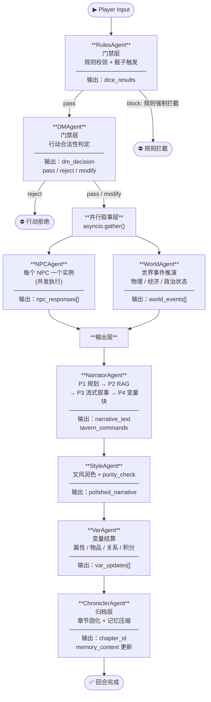

# 03 — 多 Agent 系统完整设计

> **版本**：0.2.0（2026-06 对齐实现） · **最后更新**：2026-05-31  
> **关联文件**：`01-architecture-overview.md`、`02-state-and-bus.md`、`04-extension-system.md`
>
> 注：本文档已于 2026-06 对齐实现（D0 以代码为准）。三层骨架（LangGraph 外层 + tool_loop 内层 + Bus/Part 输出）与门禁→叙事→结算→归档主链路均已落地；下列图拓扑/Narrator 变量分工/契约按实现修正。
>
> **实现对齐总览（2026-06，`backend/agents/`）**
> - **§2.1 节点集合**：实际注册 9 节点 `rules / dm_gate / dice / parallel_nw / narrator / style / var / chronicler / options`——`dm→dm_gate` 改名、**`dice`/`options` 为新增节点**、`npc+world` 合并进 `parallel_nw`。入口为 rules。
> - **§2.3 并行拓扑**：`npc‖world` 并非 LangGraph fan-out 边，而是**单节点 `parallel_npc_world_node` 内 `asyncio.gather` + deepcopy(ctx)** 手动并行（出于 LangGraph 并发写冲突）。功能等价但图层面不可见。
> - **§2.2 路由**：dm_router 多出 `needs_roll→dice` 分支（设计为二分支）；判据字段为 `rules_verdict`/`dm_verdict`。
> - **§3 各 Agent 工具清单**：与草案多处改名（Rules：check_skill_trigger/query_world_rules/read_character，无 roll_dice 工具，骰子节点内直调 engine.dice；DM：read_character/get_world_state/search_memory，verdict 多 needs_roll；World 无工具/无 tool_loop，事件用 `affects`；Style 程序化禁词+LLM，无三工具，重写阈值细化为 <0.5 全文 / 0.5~0.7 段落；Var 统一走 `engine/vm.py`，无四结算工具；Chronicler 压缩阈值为 20 条消息，无 register_narrative_hook/update_info_matrix）。
> - **§6 Narrator 四阶段**：P1 输出 schema 大幅简化为 `{scene_goal,tone,focus,pov}`；**P3/P4 变量职责与设计相反**——实际由 **P3 内联 `{{SET/ADD/...}}` 标记**产出、P4 正则抽取（非 P4 专责 `<VariableBlock>` XML）；`TavernCommand` 数据类定义但未真正产出（产 patch dict）。
> - **§5 tool_loop**：`MAX_ITERATIONS=10`（设计 20）；Hook 用全局 `hook_manager` + 工具级 hooks（dict ctx，无 `BeforeToolAction/AfterToolAction` 数据类、无 terminate）。
> - **§7.2 AgentProfile/agents.json**：配置键为 `agents.*`（非 `roles.*`），**全部 deepseek-chat**（多模型角色映射未落地）；权限 Profile 与 LLM 配置为两套独立体系（权限见 `permission.py`）。§7.1 AgentNode 缺 `system_prompt_id/profile/before_tool_call/after_tool_call/on_load/on_unload`。
> - **§3.x Gacha**：无独立 gacha Agent（与设计一致）；抽卡由 `tool_loop` 的 `draw_gacha` 工具 + `ctx.gacha_pending/gacha_granted` 状态承载。
> - **缺口（待补实现，非文档滞后）**：§8.2 `asyncio.shield`（VarAgent 用 try/except 兜底替代）、§8.3 外部 MCP 子 Agent `call_external_agent`（缺失）、narrative_hook/info_matrix 写入。

---

## 目录

1. [三层 Agent 架构总览](#1-三层-agent-架构总览)
2. [LangGraph 图设计](#2-langgraph-图设计)
3. [各 Agent 详细职责](#3-各-agent-详细职责)
4. [AgentState 定义](#4-agentstate-定义)
5. [内层 tool_use loop 实现](#5-内层-tool_use-loop-实现)
6. [NarratorAgent 四阶段管线](#6-narratoragent-四阶段管线)
7. [Agent 扩展接口](#7-agent-扩展接口)
8. [子 Agent 机制](#8-子-agent-机制)
9. [Agent 选型对比](#9-agent-选型对比)

---

## 1. 三层 Agent 架构总览

### 1.1 为什么是三层而不是单一框架

市面上常见的做法是把所有 Agent 逻辑塞进一个框架——要么全用 LangGraph，要么全用纯 tool_use loop。本项目拒绝这种做法，原因在于**三个完全不同的控制问题需要三种不同的解法**：

| 控制问题 | 最合适的抽象 | 选型来源 |
|----------|-------------|----------|
| **谁先谁后、谁并行** | 有向图（DAG） | LangGraph Pipeline |
| **一个节点内部反复调工具** | 工具调用循环 | pi agent-loop.ts 思路 |
| **流式产出的类型化分块** | Part 状态机 | opencode processor.ts 思路 |

如果把三层压缩成一层，结果是：
- 用纯 LangGraph：图节点粒度太粗，工具循环写成递归边，图结构爆炸。
- 用纯 tool_use loop：没有显式的拓扑保证，并行分支需要自己手写 asyncio 协调，且"谁先谁后"藏在代码逻辑里无法可视化。
- 用纯 opencode Processor：Part 状态机天生不处理跨 Agent 的依赖。

三层各司其职，互不侵犯。

---

### 1.2 三层职责速览

```
┌─────────────────────────────────────────────────────────────────┐
│  外层：LangGraph Pipeline                                        │
│  ─ 解决「谁先谁后、谁并行」                                       │
│  ─ 类型化共享状态 AgentState（TypedDict）                         │
│  ─ 节点可插入/替换（扩展接口 AgentNode.insert_after / .replace）  │
│                                                                  │
│  ┌──────────────┐  ┌──────────────┐  ┌──────────────┐          │
│  │  RulesAgent  │  │   DMAgent    │  │  NPCAgent    │  ...     │
│  │              │  │              │  │  (内层 loop) │          │
│  │  ┌────────┐  │  │  ┌────────┐  │  │  ┌────────┐  │          │
│  │  │tool_use│  │  │  │tool_use│  │  │  │tool_use│  │          │
│  │  │  loop  │  │  │  │  loop  │  │  │  │  loop  │  │          │
│  │  └────────┘  │  │  └────────┘  │  │  └────────┘  │          │
│  │              │  │              │  │              │          │
│  │  Part 状态机 │  │  Part 状态机 │  │  Part 状态机 │          │
│  └──────────────┘  └──────────────┘  └──────────────┘          │
│                                                                  │
│  输出层：opencode Part 状态机（每个 Agent 产出写成类型化 Part）   │
│  ─ streaming → done → error 状态转移                            │
│  ─ 发 Bus 事件（零耦合订阅）                                      │
└─────────────────────────────────────────────────────────────────┘
```

---

## 2. LangGraph 图设计

### 2.1 完整 Agent 图（Mermaid）



### 2.2 条件边定义

```python
# graph.py
from langgraph.graph import StateGraph

def rules_router(state: AgentState) -> str:
    if state["dice_results"].get("hard_block"):
        return "end_block"
    return "dm"

def dm_router(state: AgentState) -> str:
    decision = state["dm_decision"]["verdict"]
    if decision == "reject":
        return "end_reject"
    return "parallel_narrative"

builder = StateGraph(AgentState)
builder.add_node("rules",     RulesAgent())
builder.add_node("dm",        DMAgent())
builder.add_node("npc",       NPCAgent())
builder.add_node("world",     WorldAgent())
builder.add_node("narrator",  NarratorAgent())
builder.add_node("style",     StyleAgent())
builder.add_node("var",       VarAgent())
builder.add_node("chronicler",ChroniclerAgent())

builder.set_entry_point("rules")
builder.add_conditional_edges("rules", rules_router,
    {"end_block": END, "dm": "dm"})
builder.add_conditional_edges("dm", dm_router,
    {"end_reject": END, "parallel_narrative": ["npc", "world"]})
builder.add_edge(["npc", "world"], "narrator")
builder.add_edge("narrator",   "style")
builder.add_edge("style",      "var")
builder.add_edge("var",        "chronicler")
builder.add_edge("chronicler", END)
```

---

## 3. 各 Agent 详细职责

### 3.1 RulesAgent — 门禁层·规则校验

| 属性 | 值 |
|------|----|
| **输入字段** | `player_input`, `world_plugin`, `active_skills`, `turn_index` |
| **输出字段** | `dice_results`, `active_skills`（更新触发状态） |
| **Part 类型** | `RulesCheckPart`, `DiceRollPart` |
| **System Prompt** | `prompts/agents/rules_agent.md` |
| **LLM 角色** | `agents.json → roles.rules_checker`（默认 GPT-4o-mini，低延迟） |
| **工具** | `roll_dice`, `check_skill_trigger`, `query_world_rules` |

**处理逻辑**：

1. 解析 `player_input`，识别行动意图（移动/攻击/对话/技能使用）。
2. 遍历 `active_skills`，调用 `check_skill_trigger` 匹配触发条件（SKILL.md 中的 `trigger` 字段）。
3. 若需要骰子判定，调用 `roll_dice`（结果写入 `dice_results`，**此后不可修改**）。
4. 调用 `query_world_rules` 检查世界插件硬性规则（如某些行动在特定世界根本不合法）。
5. 硬性规则违反 → 输出 `hard_block=True`，LangGraph 路由至 `END`。

**Doom Loop 防护**：`tool_loop` 检测到同一工具被调用 3 次且参数完全相同，自动终止并标记 `rules_loop_warning`。

---

### 3.2 DMAgent — 门禁层·行动合法性

| 属性 | 值 |
|------|----|
| **输入字段** | `player_input`, `dice_results`, `world_plugin`, `agent_profile`, `memory_context` |
| **输出字段** | `dm_decision`（包含 `verdict`, `reason`, `modified_action`） |
| **Part 类型** | `DMDecisionPart` |
| **System Prompt** | `prompts/agents/dm_agent.md` |
| **LLM 角色** | `agents.json → roles.dungeon_master`（默认 Claude 3.5 Sonnet，叙事推理强） |
| **工具** | `query_npc_profile`, `query_world_state`, `check_consistency` |

**处理逻辑**：

1. 综合 `dice_results` 和当前世界状态，判断行动是否逻辑可行。
2. 调用 `query_npc_profile` 确认 NPC 当前知识范围（避免 NPC 无故"知道"主角未透露的信息）。
3. 调用 `check_consistency` 对照 `memory_context` 中最近 20 章摘要，检查行动是否与已建立的叙事矛盾。
4. 输出 `verdict`：
   - `pass`：行动合法，原样传递。
   - `modify`：行动合法但需要微调（如骰子失败导致效果打折），`modified_action` 字段写入调整后的行动。
   - `reject`：行动不合理，`reason` 字段给出中文说明，LangGraph 路由至 `END_REJECT`。

---

### 3.3 NPCAgent — 并行叙事层·NPC 响应

| 属性 | 值 |
|------|----|
| **输入字段** | `dm_decision`, `world_events`（来自 WorldAgent 的先前轮次缓存）, `memory_context` |
| **输出字段** | `npc_responses: list[NPCResponse]` |
| **Part 类型** | `NPCDialoguePart`, `NPCActionPart` |
| **System Prompt** | `prompts/agents/npc_agent.md` + 动态注入 NPC 档案（`psyche_model_json`） |
| **LLM 角色** | `agents.json → roles.npc_voice`（每个 NPC 可单独覆盖模型） |
| **工具** | `query_npc_profile`, `update_npc_state`, `get_npc_knowledge_scope` |

**处理逻辑**：

1. 从 `dm_decision.involved_npcs` 取出本轮涉及的 NPC 列表。
2. **并发**：为每个 NPC 启动独立的 `tool_loop`（asyncio.gather），各自持有独立消息历史。
3. 每个子循环内：`get_npc_knowledge_scope` 约束 NPC 只能响应其已知信息范围内的内容。
4. 产出 `NPCDialoguePart`（对话）或 `NPCActionPart`（行动），写入 `npc_responses` 列表。
5. 结束后调用 `update_npc_state`，持久化 NPC 情绪/关系变化（写入数据库，不阻塞主链路）。

**重要约束**：NPC 不能感知主角未透露的信息（来自 `05-character-consistency.mdc` 规则，在 System Prompt 中硬编码）。

---

### 3.4 WorldAgent — 并行叙事层·世界推演

| 属性 | 值 |
|------|----|
| **输入字段** | `dm_decision`, `world_plugin`, `turn_index`, `memory_context` |
| **输出字段** | `world_events: list[WorldEvent]` |
| **Part 类型** | `WorldEventPart` |
| **System Prompt** | `prompts/agents/world_agent.md` + `world_plugin.rules_skills`（世界规则 SKILL.md） |
| **LLM 角色** | `agents.json → roles.world_simulator` |
| **工具** | `query_world_state`, `update_economy`, `trigger_faction_event` |

**处理逻辑**：

1. 根据 `dm_decision` 中的行动，推演世界状态的后续变化（经济波动、派系反应、自然事件）。
2. 调用 `update_economy` 处理积分/货币流动（不直接修改 `var_updates`，由 VarAgent 统一结算）。
3. 输出 `world_events` 列表，每个事件包含：`event_type`, `impact_scope`, `description`, `variable_deltas_preview`（预览，最终由 VarAgent 确认）。

---

### 3.5 NarratorAgent — 输出层·叙事主生成

> 详见第 6 节「四阶段管线」完整展开。

| 属性 | 值 |
|------|----|
| **输入字段** | `npc_responses`, `world_events`, `dm_decision`, `memory_context`, `world_plugin` |
| **输出字段** | `narrative_text`, `tavern_commands: list[TavernCommand]` |
| **Part 类型** | `NarrativePart`（流式）, `PlanPart`, `VariableBlockPart` |
| **System Prompt** | `prompts/agents/narrator_agent.md`（四阶段模板） |
| **LLM 角色** | `agents.json → roles.narrator`（默认 Claude Opus，创意写作最强） |
| **工具** | `search_lore`, `query_character`, `get_chapter_context`（P2 阶段纯 Python，不调 LLM） |

---

### 3.6 StyleAgent — 输出层·文风润色

| 属性 | 值 |
|------|----|
| **输入字段** | `narrative_text`, `world_plugin.style_config`, `active_skills`（文风相关 SKILL） |
| **输出字段** | `polished_narrative`, `purity_score: float` |
| **Part 类型** | `StyleCheckPart`, `PurityReportPart` |
| **System Prompt** | `prompts/agents/style_agent.md`（内嵌全局禁词表 + 各文风铁律） |
| **LLM 角色** | `agents.json → roles.style_editor`（默认 GPT-4o，速度与质量均衡） |
| **工具** | `check_banned_words`, `apply_style_template`, `purity_check` |

**处理逻辑**：

1. `check_banned_words`：扫描 `narrative_text`，检测全局禁词（来自 `03-writing-style.mdc`）。
2. `apply_style_template`：根据 `world_plugin.style_config` 中的 `scene_type` 参数选择文风原子文件并应用。
3. `purity_check`：检测 AI 写作陈词滥调（来自 `12-anti-llm-cliche-and-purity.mdc`），输出 `purity_score`（0-1，低于 0.7 触发重写）。
4. 若 `purity_score < 0.7`：自动重写问题段落（最多重写 2 次，超限则标记 `style_warning` 发 Bus 事件）。

---

### 3.7 VarAgent — 输出层·变量结算

| 属性 | 值 |
|------|----|
| **输入字段** | `tavern_commands`, `world_events`（`variable_deltas_preview`）, `world_plugin.attribute_schema` |
| **输出字段** | `var_updates: list[VarUpdate]` |
| **Part 类型** | `VarUpdatePart`（流式）, `VarSummaryPart` |
| **System Prompt** | `prompts/agents/var_agent.md` |
| **LLM 角色** | `agents.json → roles.var_calculator`（默认 GPT-4o-mini，数值计算任务） |
| **工具** | `apply_attribute_delta`, `grant_item`, `update_relationship`, `credit_points` |

**处理逻辑**：

1. 解析 `tavern_commands` 中的 `UpdateVariable` 指令（由 NarratorAgent P4 阶段生成）。
2. 对照 `world_plugin.attribute_schema` 验证属性范围（如 STR 不得超过当前进化阶段上限）。
3. 依次执行 `apply_attribute_delta` / `grant_item` / `update_relationship` / `credit_points`。
4. 所有变更打包成 `VarSummaryPart` 发 Bus 事件，前端订阅后刷新角色面板。

**隔离设计**：VarAgent 以独立子 Session 运行（见第 8 节），确保变量结算失败不影响叙事文本。

---

### 3.8 ChroniclerAgent — 归档层

| 属性 | 值 |
|------|----|
| **输入字段** | `narrative_text`（最终版）, `var_updates`, `npc_responses`, `chapter_id`, `turn_index` |
| **输出字段** | `chapter_id`（更新）, `memory_context`（压缩后） |
| **Part 类型** | `ChapterAnchorPart`, `MemorySummaryPart` |
| **System Prompt** | `prompts/agents/chronicler_agent.md` |
| **LLM 角色** | `agents.json → roles.chronicler`（默认 Claude 3.5 Haiku，长文摘要） |
| **工具** | `write_chapter_anchor`, `compress_memory`, `register_narrative_hook`, `update_info_matrix` |

**处理逻辑**：

1. `write_chapter_anchor`：将本轮叙事写入 `chapter_anchors` 表（含 embedding）。
2. `compress_memory`：当 `turn_index` 为 5 的倍数时，压缩最旧 5 轮记忆为摘要，更新 `memory_context`。
3. `register_narrative_hook`：检测叙事中出现的新伏笔，注册到 `narrative_hooks` 表（`active=True`）。
4. `update_info_matrix`：同步主角/NPC 的知识矩阵（哪些信息发生了变化）。

---

## 4. AgentState 定义

```python
# core/state.py
from __future__ import annotations
from typing import TypedDict, Literal, Any
from dataclasses import dataclass, field


@dataclass(frozen=True)
class DiceResult:
    """骰子结果不可变（frozen=True），一经产生禁止修改。"""
    dice_type: str                    # "d20", "2d6" 等
    raw_rolls: tuple[int, ...]        # 原始点数
    modifier: int                     # 属性加成
    total: int                        # 最终结果
    success: bool                     # 是否成功（对照 DC）
    critical: bool                    # 是否暴击/大失败
    triggered_by_skill: str | None    # 触发该骰的 SKILL.md id


@dataclass
class DMDecision:
    verdict: Literal["pass", "reject", "modify"]
    reason: str                       # 中文说明（reject 时展示给玩家）
    modified_action: str | None       # modify 时的调整后行动描述
    involved_npcs: list[str]          # 本轮涉及的 NPC key 列表
    consequence_preview: str | None   # 行动可能后果的预告（可选）


@dataclass
class NPCResponse:
    npc_key: str
    dialogue: str | None              # 对话文本
    action: str | None                # 行动描述
    emotion_delta: dict[str, float]   # 情绪变化 {"trust": +0.1}
    knowledge_gained: list[str]       # 本轮 NPC 新获知的信息 key


@dataclass
class WorldEvent:
    event_type: str                   # "economy_shift", "faction_reaction" 等
    impact_scope: Literal["local", "regional", "global"]
    description: str
    variable_deltas_preview: dict[str, Any]  # 预览，VarAgent 最终确认


@dataclass
class TavernCommand:
    """NarratorAgent P4 阶段生成的结构化指令。"""
    command_type: Literal[
        "UpdateAttribute", "GrantItem", "RemoveItem",
        "UpdateRelationship", "CreditPoints", "TriggerEvent",
        "RegisterHook"
    ]
    target: str                       # 角色 key / 物品 key / 伏笔 key
    payload: dict[str, Any]


@dataclass
class VarUpdate:
    update_type: str
    target: str
    before: Any
    after: Any
    source: str                       # "narrator_p4" | "world_event" | "dm_modify"


class AgentState(TypedDict):
    # ── 基础会话标识 ──────────────────────────────────────────────
    session_id: str
    message_id: str                   # 本轮消息唯一 ID
    novel_id: str                     # 小说/剧本 ID
    chapter_id: str                   # 当前章节 ID
    turn_index: int                   # 本章第几轮

    # ── 输入 ──────────────────────────────────────────────────────
    player_input: str                 # 玩家原始输入
    world_plugin: str                  # 世界插件键（如 "muv_luv"）
    # ⚠️ 实现差异：设计草案为 dict，实现为 str 键（WorldPlugin 对象在运行时通过 key 查注册表）
    agent_profile: dict[str, Any]     # 当前 session 的 Agent 权限配置
    mode: Literal[
        "play", "plan", "review"
    ]
    # ⚠️ 实现差异：设计草案曾为场景枚举（story/combat/exploration/social/montage/epilogue）
    # 实现统一为权限模式枚举（play=自由游玩/plan=规划模式/review=审阅模式），见 10-permission-modes.md

    # ── 门禁层输出（不可变） ──────────────────────────────────────
    dice_results: list[DiceResult]    # ★ 骰子结果，一经写入不可修改
    dm_decision: DMDecision           # DM 的行动合法性判定

    # ── 并行叙事层输出 ─────────────────────────────────────────────
    npc_responses: list[NPCResponse]
    world_events: list[WorldEvent]

    # ── 输出层产物 ──────────────────────────────────────────────────
    narrative_text: str               # StyleAgent 润色后的最终叙事文本
    tavern_commands: list[TavernCommand]  # 结构化游戏指令
    var_updates: list[VarUpdate]      # 变量结算结果

    # ── 上下文与记忆 ──────────────────────────────────────────────
    memory_context: str                # 记忆召回结果（已格式化为注入字符串）
    # ⚠️ 实现差异：设计草案为 dict，实现为格式化后的字符串直接注入 prompt
    active_skills: list[dict[str, Any]]  # 当前激活的 SKILL.md 列表

    # ── 归档层产物 ──────────────────────────────────────────────────
    chapter_anchor_id: str | None     # 本轮写入的章节锚点 ID
    info_matrix_updates: list[dict]   # 信息矩阵变更记录

    # ── 错误与警告 ──────────────────────────────────────────────────
    warnings: list[str]               # 非致命警告（doom_loop_warning 等）
    error: str | None                 # 致命错误，触发时终止管线
```

---

## 5. 内层 tool_use loop 实现

每个 LangGraph 节点（Agent）内部都运行一个 pi 风格的工具调用循环。这是防止"无限调用"（Doom Loop）的核心机制。

### 5.1 完整伪代码

```python
# core/tool_loop.py
import asyncio
from collections import deque
from typing import Callable, Any

DOOM_LOOP_THRESHOLD = 3      # 连续相同调用次数阈值
MAX_ITERATIONS = 20          # 绝对上限


async def tool_loop(
    state: AgentState,
    tools: list[ToolDef],
    agent_name: str,
    bus: EventBus,
    before_hook: Callable | None = None,
    after_hook: Callable | None = None,
) -> tuple[str, list[ToolCallRecord]]:
    """
    pi 风格工具调用循环。
    
    返回：(最终文本输出, 工具调用记录列表)
    """
    messages = build_initial_messages(state, agent_name)
    tool_records: list[ToolCallRecord] = []
    call_history: deque[str] = deque(maxlen=DOOM_LOOP_THRESHOLD)
    iteration = 0

    while iteration < MAX_ITERATIONS:
        iteration += 1

        # ── LLM 调用（流式）────────────────────────────────────────
        response = await stream_llm(
            messages=messages,
            tools=tools,
            agent_name=agent_name,
        )

        # ── 发 Part 事件（streaming → done）────────────────────────
        await bus.emit(AgentStreamPart(
            agent=agent_name,
            content=response.text_so_far,
            status="streaming",
        ))

        # ── 无工具调用 → 循环结束 ──────────────────────────────────
        if not response.tool_calls:
            await bus.emit(AgentStreamPart(
                agent=agent_name,
                content=response.text,
                status="done",
            ))
            return response.text, tool_records

        # ── 处理每个工具调用 ────────────────────────────────────────
        tool_results = []
        for tool_call in response.tool_calls:

            # Doom Loop 检测
            call_fingerprint = f"{tool_call.name}:{tool_call.args_hash()}"
            call_history.append(call_fingerprint)
            if call_history.count(call_fingerprint) >= DOOM_LOOP_THRESHOLD:
                warning = f"doom_loop:{agent_name}:{tool_call.name}"
                state["warnings"].append(warning)
                await bus.emit(WarningPart(agent=agent_name, warning=warning))
                # 强制终止循环
                return response.text, tool_records

            # before_hook：可以 block 或 modify 工具调用
            if before_hook:
                action = await before_hook(tool_call, state)
                if action.block:
                    tool_results.append(ToolResult(
                        tool_call_id=tool_call.id,
                        content=f"[blocked by hook: {action.reason}]",
                    ))
                    continue
                if action.modified_args:
                    tool_call = tool_call.with_args(action.modified_args)

            # 执行工具
            try:
                result = await execute_tool(tool_call, state)
            except ToolExecutionError as e:
                result = ToolResult(
                    tool_call_id=tool_call.id,
                    content=f"[error: {e}]",
                    error=True,
                )
                await bus.emit(ToolErrorPart(
                    agent=agent_name,
                    tool=tool_call.name,
                    error=str(e),
                ))

            # after_hook：可以替换 result 或终止循环
            if after_hook:
                action = await after_hook(tool_call, result, state)
                if action.replace_result:
                    result = action.replace_result
                if action.terminate:
                    tool_records.append(ToolCallRecord(tool_call, result))
                    return response.text, tool_records

            # 发 ToolResultPart Bus 事件
            await bus.emit(ToolResultPart(
                agent=agent_name,
                tool=tool_call.name,
                args=tool_call.args,
                result=result.content,
                duration_ms=result.duration_ms,
            ))

            tool_records.append(ToolCallRecord(tool_call, result))
            tool_results.append(result)

        # 把工具结果追加到消息历史，继续下一轮
        messages = append_tool_results(messages, response, tool_results)

    # 超出绝对上限
    state["warnings"].append(f"max_iterations_exceeded:{agent_name}")
    return "", tool_records
```

### 5.2 Hook 接口定义

```python
@dataclass
class BeforeToolAction:
    block: bool = False
    reason: str = ""
    modified_args: dict | None = None

@dataclass
class AfterToolAction:
    replace_result: ToolResult | None = None
    terminate: bool = False

# 注册 Hook 示例（在扩展的 plugin.py 中）
async def before_dice_roll(tool_call: ToolCall, state: AgentState) -> BeforeToolAction:
    """在 RulesAgent 中拦截骰子：若主角有"幸运"技能，强制重骰一次取高。"""
    if tool_call.name == "roll_dice" and "lucky_charm" in state["active_skills"]:
        # 不 block，只记录，让 after_hook 处理重骰
        return BeforeToolAction(block=False)
    return BeforeToolAction(block=False)
```

---

## 6. NarratorAgent 四阶段管线

NarratorAgent 是整个系统中最复杂的 Agent，源自 ai-vn-game-system 的叙事管线设计，分为四个严格顺序的阶段。

### 6.1 P1 — 规划阶段（非流式）

```
输入：完整 AgentState
LLM 参数：temperature=0.3（低，保证结构一致性）
输出格式：强制 JSON（使用 response_format=json_object）
```

**P1 输出 JSON 结构**：

```json
{
  "outline": {
    "scene_type": "combat",
    "estimated_length": "medium",
    "key_beats": ["主角反击", "NPC倒戈", "boss 逃脱"],
    "tone": "intense"
  },
  "log_query_terms": [
    "第二次冲击",
    "白银武 TSF 战斗",
    "夕呼 情报"
  ],
  "req_char_update": ["白银武", "鹭宫恭子"],
  "req_world_state": ["月面基地状态", "BETA 数量"],
  "style_directives": {
    "pov": "third_person_close",
    "rhythm": "fast_cuts",
    "forbidden_patterns": ["一丝", "仿佛"]
  },
  "variable_block_preview": {
    "expected_updates": ["hp_delta", "exp_gain", "flag_set"]
  }
}
```

**P1 不产生任何叙事文本**，只产生元信息供 P2、P3、P4 使用。

---

### 6.2 P2 — 检索阶段（纯 Python，不调 LLM）

```python
async def p2_retrieve(plan: P1Output, state: AgentState) -> RetrievalContext:
    """
    纯 Python 检索，零 LLM 调用，最小化延迟。
    """
    tasks = [
        # 关键词 RAG（向量 + BM25 混合召回）
        search_lore_hybrid(
            novel_id=state["novel_id"],
            queries=plan.log_query_terms,
            top_k=8,
        ),
        # 角色档案批量拉取
        asyncio.gather(*[
            query_character(state["novel_id"], npc)
            for npc in plan.req_char_update
        ]),
        # 世界状态批量查询
        asyncio.gather(*[
            query_world_state_key(state["novel_id"], key)
            for key in plan.req_world_state
        ]),
        # 战斗实体匹配（如果 scene_type == "combat"）
        match_combat_entities(state) if plan.outline.scene_type == "combat" else None,
    ]
    results = await asyncio.gather(*tasks)
    return RetrievalContext(
        lore_chunks=results[0],
        npc_profiles=results[1],
        world_states=results[2],
        combat_entities=results[3],
    )
```

**P2 的核心价值**：将所有数据库 I/O 并发执行，并在 P3 LLM 调用开始前完成，避免 LLM 生成过程中的额外等待。

---

### 6.3 P3 — 叙事生成阶段（流式主生成）

```
LLM 参数：temperature=0.75, stream=True
长度约束：min_tokens=200, max_tokens=1200
System Prompt：注入 P1.style_directives + P2.retrieval_context
严格禁止：P3 阶段 LLM 不允许输出 UpdateVariable 指令（由 P4 专门处理）
```

**P3 System Prompt 注入顺序**：

```
[角色扮演指令] narrator_agent.md 基础提示
[风格指令]     P1.style_directives（本次专用）
[世界知识]     P2.lore_chunks（RAG 召回片段）
[角色档案]     P2.npc_profiles（本轮涉及 NPC）
[世界状态]     P2.world_states
[当前局面]     DM Decision + NPC Responses + World Events
[写作铁律]     全局禁词表（来自 03-writing-style.mdc）
[禁止指令]     严禁在 P3 输出任何 <UpdateVariable> 标签
```

**长度阈值重试**：

```python
async def p3_narrate(plan, retrieval, state, bus) -> str:
    for attempt in range(3):
        text = ""
        async for chunk in stream_llm_p3(plan, retrieval, state):
            text += chunk.delta
            await bus.emit(NarrativePart(content=chunk.delta, status="streaming"))
        
        word_count = len(text)
        if word_count >= plan.outline.min_length:
            await bus.emit(NarrativePart(content=text, status="done"))
            return text
        
        # 长度不足：追加续写指令重试
        plan = plan.with_continuation_hint(
            f"当前叙事 {word_count} 字，需要继续展开至少 {plan.outline.min_length - word_count} 字。"
        )
    
    # 3 次仍不足：发 warning，接受当前结果
    state["warnings"].append("narrator_p3_length_insufficient")
    return text
```

---

### 6.4 P4 — 变量块阶段（流式专用）

```
LLM 参数：temperature=0.1（极低，保证格式正确）
输出格式：结构化标签块（非自由文本）
重试上限：3 次（来自 P1.variable_block_preview 预期格式）
```

**P4 输出格式**：

```
<VariableBlock>
  <UpdateAttribute target="白银武" key="hp" delta="-15" reason="BETA 爪击" />
  <UpdateAttribute target="白银武" key="exp" delta="+120" reason="战斗胜利" />
  <GrantItem target="白银武" item_key="beta_core_fragment" quantity="1" />
  <UpdateRelationship subject="白银武" object="鹭宫恭子" key="trust" delta="+5" />
  <CreditPoints target="白银武" amount="200" source="mission_reward" />
  <RegisterHook trigger="next_chapter_start" content="恭子主动找到白银武谈话" />
</VariableBlock>
```

**P4 续写重试**：

```python
async def p4_variable_block(plan, narrative, state, bus) -> list[TavernCommand]:
    expected_keys = set(plan.variable_block_preview.expected_updates)
    
    for attempt in range(3):
        raw = await generate_variable_block(narrative, state, expected_keys)
        commands = parse_tavern_commands(raw)
        
        missing = expected_keys - {cmd.command_type for cmd in commands}
        if not missing:
            return commands
        
        # 有缺失：注入续写提示
        expected_keys = missing  # 只重试缺失部分
    
    state["warnings"].append(f"narrator_p4_missing_commands:{missing}")
    return commands  # 返回不完整结果，VarAgent 会处理
```

---

## 7. Agent 扩展接口

所有自定义 Agent 节点必须继承 `AgentNode` 抽象基类，通过 `insert_after` 或 `replace` 声明在 LangGraph 图中的位置。

```python
# core/agent_node.py
from abc import ABC, abstractmethod
from dataclasses import dataclass, field


@dataclass
class AgentProfile:
    """Agent 权限配置（来自 agents.json）。"""
    llm_role: str                     # 对应 agents.json 中的角色键
    tool_permissions: dict[str, Literal["allow", "ask", "deny"]]
    max_tokens: int = 2048
    temperature: float = 0.7
    timeout_seconds: float = 60.0
    retry_limit: int = 2


class AgentNode(ABC):
    """
    可插入 LangGraph 图的 Agent 节点基类。
    
    内置 WorldPlugin 或用户扩展均通过此接口注册新节点。
    """

    # ── 元数据（子类必须定义） ─────────────────────────────────────
    name: str                         # 唯一节点名（如 "my_custom_agent"）
    display_name: str                 # 用户可见名称
    system_prompt_id: str             # prompts/agents/*.md 文件 ID
    profile: AgentProfile             # LLM 角色与权限

    # ── 图注入位置（二选一） ──────────────────────────────────────
    insert_after: str | None = None   # 在哪个节点之后插入（如 "narrator"）
    replace: str | None = None        # 替换哪个现有节点（如 "style"）

    # ── 工具列表 ──────────────────────────────────────────────────
    tools: list[ToolDef] = field(default_factory=list)

    # ── Hook（可选覆盖） ──────────────────────────────────────────
    async def before_tool_call(
        self, tool_call: ToolCall, state: AgentState
    ) -> BeforeToolAction:
        return BeforeToolAction(block=False)

    async def after_tool_call(
        self, tool_call: ToolCall, result: ToolResult, state: AgentState
    ) -> AfterToolAction:
        return AfterToolAction()

    # ── 核心执行（必须实现） ──────────────────────────────────────
    @abstractmethod
    async def execute(self, state: AgentState) -> AgentState:
        """执行节点逻辑，返回更新后的 AgentState。"""
        ...

    # ── 生命周期（可选） ──────────────────────────────────────────
    async def on_load(self, config: dict) -> None:
        """扩展加载时调用（如建立数据库连接）。"""
        pass

    async def on_unload(self) -> None:
        """扩展卸载时调用（如释放资源）。"""
        pass
```

**注册示例**（在 `extensions/my_world/agents.py` 中）：

```python
class CustomJudgeAgent(AgentNode):
    name = "custom_judge"
    display_name = "自定义裁判"
    system_prompt_id = "custom_judge"
    insert_after = "dm"              # 在 DMAgent 之后插入
    replace = None

    profile = AgentProfile(
        llm_role="dungeon_master",   # 复用 DM 的 LLM 角色
        tool_permissions={"query_npc_profile": "allow"},
    )

    async def execute(self, state: AgentState) -> AgentState:
        # 自定义逻辑
        text, records = await tool_loop(
            state=state,
            tools=self.tools,
            agent_name=self.name,
            bus=get_bus(),
            before_hook=self.before_tool_call,
            after_hook=self.after_tool_call,
        )
        state["warnings"].append("custom_judge_ran")
        return state
```

---

## 8. 子 Agent 机制

系统支持三种不同隔离级别的子 Agent 模式，根据任务特性选择。

### 8.1 进程内子 Session（opencode TaskTool 风格）

```
隔离级别：低
延迟：最小（同进程内存共享）
适用：NPC 并发实例、StyleAgent 重写循环
```

```python
# 在 NPCAgent 中为每个 NPC 启动子 Session
async def run_npc_concurrently(npc_keys: list[str], state: AgentState) -> list[NPCResponse]:
    sub_states = [
        create_sub_state(state, context={"npc_focus": key})
        for key in npc_keys
    ]
    tasks = [
        tool_loop(
            state=sub_state,
            tools=NPC_TOOLS,
            agent_name=f"npc_{key}",
            bus=get_bus(),
        )
        for sub_state, key in zip(sub_states, npc_keys)
    ]
    results = await asyncio.gather(*tasks, return_exceptions=True)
    return [parse_npc_response(r, key) for r, key in zip(results, npc_keys)]
```

### 8.2 独立工具调用隔离

```
隔离级别：中等
延迟：小（跨协程隔离，但同进程）
适用：VarAgent（变量结算失败不影响叙事）、ChroniclerAgent（I/O 密集）
```

```python
# VarAgent 通过 asyncio.shield 保护，即使取消也完成结算
async def run_var_agent_isolated(state: AgentState) -> list[VarUpdate]:
    return await asyncio.shield(
        _var_agent_execute(state)
    )
```

### 8.3 外部 MCP Agent

```
隔离级别：最高（独立进程/服务）
延迟：最大（RPC 调用）
适用：需要最大隔离的扩展 Agent（如第三方数值引擎、外部审计服务）
```

```python
# 通过 MCP stdio 调用外部 Agent
async def call_external_agent(agent_id: str, payload: dict) -> dict:
    mcp_client = get_mcp_client(agent_id)
    result = await mcp_client.call_tool(
        tool_name="run_agent",
        arguments=payload,
        timeout=30.0,
    )
    return result
```

---

## 9. Agent 选型对比

| 维度 | LangGraph Pipeline | opencode Processor (Part 状态机) | pi tool_use Loop |
|------|-------------------|----------------------------------|-----------------|
| **核心抽象** | 有向图（节点 + 边） | 类型化 Part + 状态机 | While + tool_calls 列表 |
| **解决的问题** | 谁先谁后、谁并行 | 产出的类型化分块与状态追踪 | 一个节点内的反复工具调用 |
| **状态共享** | TypedDict 全局共享 | Part 事件 Bus（零耦合） | 消息历史追加 |
| **并发模型** | `asyncio.gather` 边 | 无（Part 是单向流） | 单协程内串行 |
| **可视化** | 原生图结构可视化 | 事件流日志 | 无（需要额外工具） |
| **扩展方式** | 插入/替换节点 | 新 Part 类型 | 新 ToolDef |
| **Doom Loop 防护** | 靠图结构（有向无环） | 无（状态机转移有限） | ★ 连续调用检测 |
| **最适合** | 跨 Agent 编排 | 前端订阅与流式渲染 | Agent 内部工具调用 |
| **本项目用途** | 外层：定义执行拓扑 | 输出层：Bus 事件分发 | 内层：每个节点的工具循环 |
| **主要缺陷** | 图结构调试复杂 | 无法表达依赖关系 | 缺少全局视图 |

**结论**：三者不是竞争关系，而是**互补的垂直分层**。LangGraph 管全局拓扑，Part 状态机管输出格式，pi Loop 管工具调用细节。任何一层单独使用都会产生另外两层的问题。
